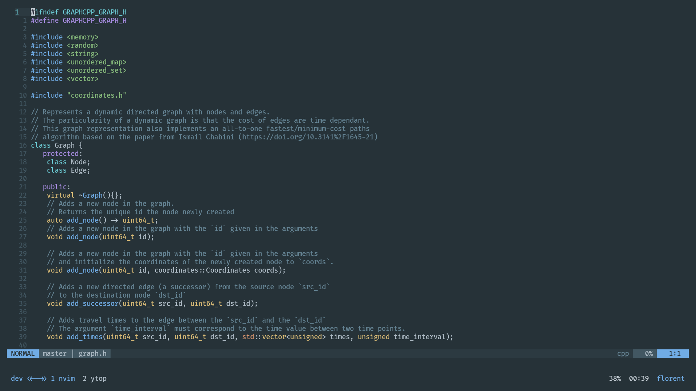
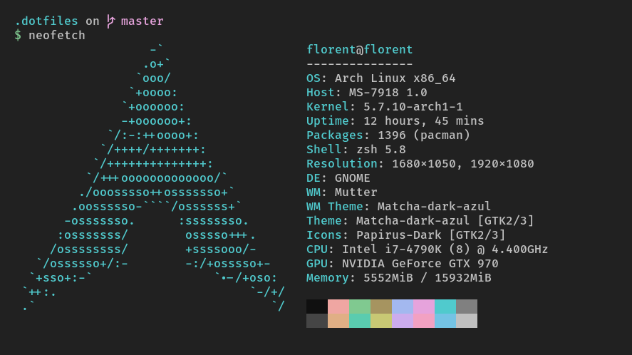

# Dotfiles

## Screenshot of the actual configuration


## Neofetch


## Programs
 - Terminal: Kitty 
```
kitty 0.18.1 created by Kovid Goyal
```
 - Prompt: Startship
 - Editor: Neovim (latest build, need to be compiled by hand for the new nvim-lsp feature)
Note: [vim-plug](https://github.com/junegunn/vim-plug) is the plugin manager used in my init.vim
```
NVIM v0.5.0-610-g326b87feb-dirty
Build type: Release
LuaJIT 2.1.0-beta3
Compilation: /usr/bin/cc -O2 -DNDEBUG -Wall -Wextra -pedantic -Wno-unused-parameter -Wstrict-prototypes -std=gnu99 -Wshadow -Wconversion -Wmissing-prototypes -Wimplicit-fallthrough -Wvla -fstack-protector-strong -fno-common -fdiagnostics-color=always -DINCLUDE_GENERATED_DECLARATIONS -D_GNU_SOURCE -DNVIM_MSGPACK_HAS_FLOAT32 -DNVIM_UNIBI_HAS_VAR_FROM -DMIN_LOG_LEVEL=3 -I/home/florent/dev/software/neovim/build/config -I/home/florent/dev/software/neovim/src -I/home/florent/dev/software/neovim/.deps/usr/include -I/usr/include -I/home/florent/dev/software/neovim/build/src/nvim/auto -I/home/florent/dev/software/neovim/build/include
Compiled by florent@florent

Features: +acl +iconv +tui
See ":help feature-compile"

   system vimrc file: "$VIM/sysinit.vim"
  fall-back for $VIM: "/usr/local/share/nvim"

Run :checkhealth for more info
```
 - Terminal multiplexer: Tmux
Note: [Tpm](https://github.com/tmux-plugins/tpm) is the plugin manager used for the tmux configuration
```
tmux 3.1b
```
